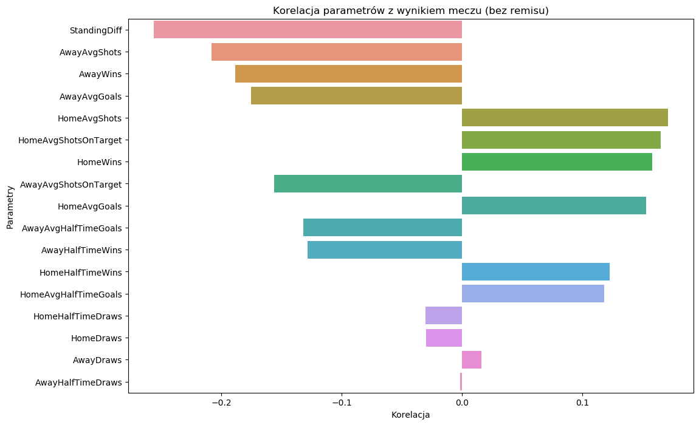

# Football Match Predictor

## Opis projektu

Celem projektu jest przewidywanie wyników meczów piłkarskich na podstawie danych historycznych, takich jak miejsce w ubiegłym sezonie oraz forma w ostatnich kilku meczach.

## Źródło danych

Dane zostały zaczerpnięte z:
- [https://www.kaggle.com/datasets/evangower/premier-league-matches-19922022](https://www.kaggle.com/datasets/evangower/premier-league-matches-19922022)
- [https://www.kaggle.com/datasets/evangower/english-premier-league-standings](https://www.kaggle.com/datasets/evangower/english-premier-league-standings)

Zawierają one statystyki z blisko 30 lat meczów pierwszej ligi angielskiej, w tym podstawowe informacje takie jak nazwy drużyn, wyniki meczów, statystyki do przerwy oraz kursy bukmacherskie.

## Preprocessing danych

W pierwszej kolejności wybrano sezony od 2000 do 2022 roku, usunięto kolumny związane z kursami bukmacherskimi i złączono dane w jeden plik `matches.csv` przy pomocy skryptu `csv_prep.py`.

Dalszy preprocessing polegał na analizie wszystkich meczów i wyznaczeniu formy drużyn z ostatnich pięciu meczów oraz różnicy punktowej w ubiegłych sezonach. Dane w obrobionej formie zostały zapisane w pliku `processed_matches.csv`.

## Analiza i podział danych

W pierwszej kolejności zbadano podstawowe dane, takie jak:
- rozkład zwycięstw gospodarzy, gości oraz remisów,
- zależność wyniku meczu od rezultatu do przerwy,
- zależność różnicy punktowej w tabeli od wyniku meczu.

Następnie wykonano analizę statystyczną, aby zbadać, które czynniki mają największy wpływ na wynik:

Jak widać, największy wpływ na wynik ma różnica punktowa. Wykazano również bardzo małą korelację cech dla remisu.

Z racji, że mamy do czynienia z problemem przewidywania zależnym od czasu, model należy testować na danych późniejszych w czasie niż trenowanych. W związku z tym za dane testowe wzięto dwa ostatnie sezony (2021, 2022).

Z danych usunięto niepotrzebne kolumny, takie jak daty, nazwy drużyn oraz liczba bramek strzelonych w meczu, itd.

## Trenowanie klasyfikatorów
Wstępnie wybrano następujące klasyfikatory:
- LogisticRegression
- RandomForest
- K-NearestNeighbors
- SupportVectorClassifier
- GaussianNaiveBayes
- GradientBoosting
- DecisionTree
- AdaBoost
- Multi-LayerPerceptron
- StochasticGradientDescent

Po ich wytrenowaniu wybrano pięć najlepszych:
- LogisticRegression 
- RandomForest
- SupportVectorClassifier
- GradientBoosting
- AdaBoost

Na ich podstawie stworzono model podejmujący decyzję na podstawie sumy prawdopodobieństw zwracanych przez te klasyfikatory. Model został zapisany do pliku `EnsembleClassifier.joblib`.

## Testowanie modelu
Dla danych testowych uzyskano następującą macierz konfuzji:

Model ma problem z przewidywaniem remisów, co jest związane z tym, że zazwyczaj szacowane prawdopodobieństwo uzyskania remisu jest pomiędzy prawdopodobieństwem wygranej gospodarzy lub gości. Jest to również powód współczynnika accuracy na poziomie ~52%, który mimo wszystko jest wyższy niż losowe wybieranie wyników (~33%).

Ciekawiej prezentuje się porównanie średnich prawdopodobieństw wyników zwracanych przez model do procentowej ilości rzeczywistych rezultatów:

Wykres pokazuje dużą zgodność, co wskazuje na poprawność szacowanych prawdopodobieństw.
## Uruchomienie projektu

Lista wymaganych zależności znajduje się w pliku `requirements.txt`. Na końcu pliku `project.ipynb` znajduje się przykład wykorzystania modelu w praktyce do szacowania wyników meczów. Format danych wejściowych powinien być taki sam jak w pliku `example_matches.csv`.

